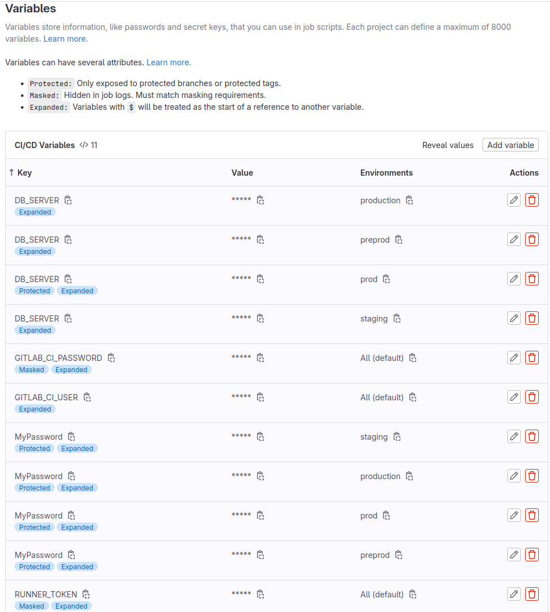
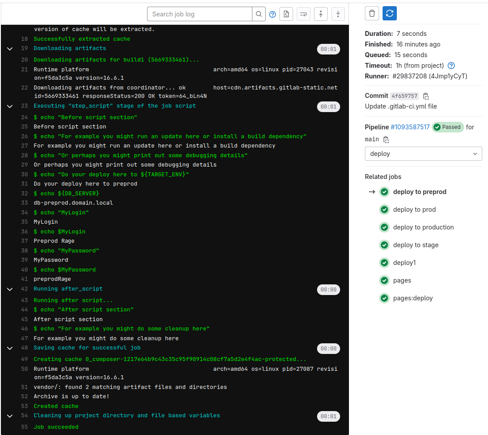
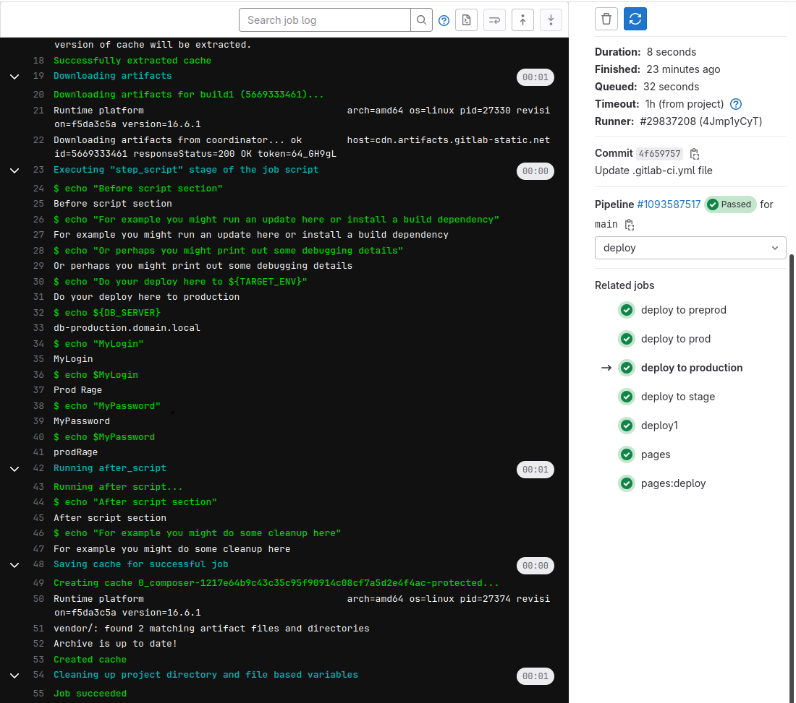
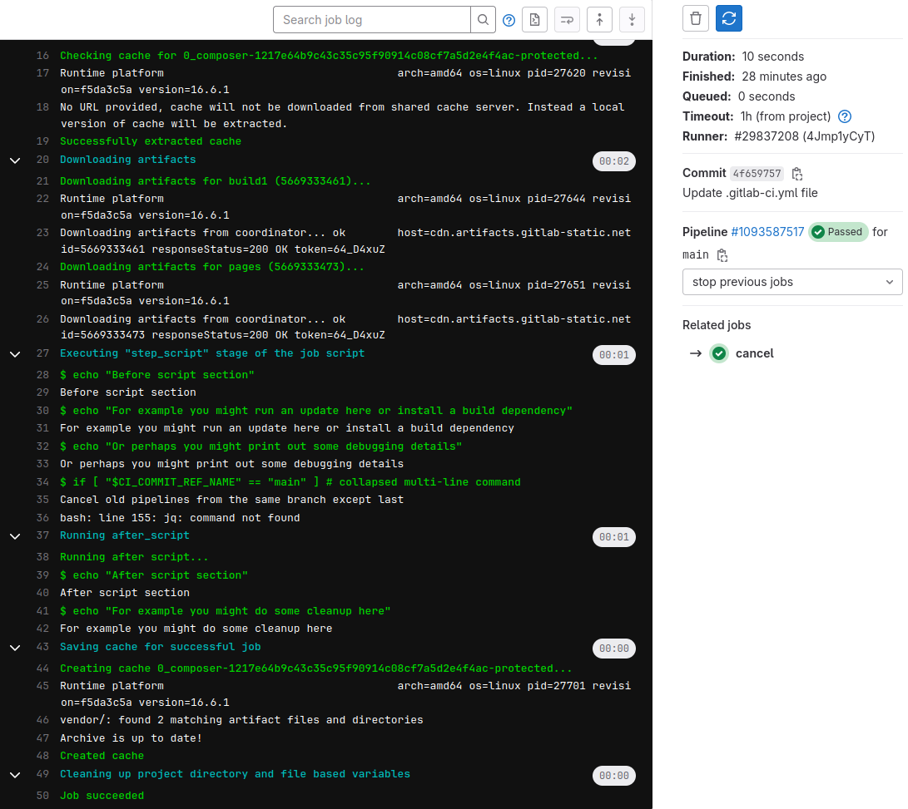

```yaml
deploy to preprod:
  stage: deploy
  variables:
    TARGET_ENV: preprod
    MyLogin: "Preprod Rage"
  script:
    - echo "Do your deploy here to ${TARGET_ENV}"
    - echo ${DB_SERVER}
    - echo "MyLogin"
    - echo $MyLogin
    - echo "MyPassword"
    - echo $MyPassword
  only:
    - main
  environment:
    name: preprod
```

```yaml
deploy to production:
  stage: deploy
  variables:
    TARGET_ENV: production
    MyLogin: "Prod Rage"
  script:
    - echo "Do your deploy here to ${TARGET_ENV}"
    - echo ${DB_SERVER}
    - echo "MyLogin"
    - echo $MyLogin
    - echo "MyPassword"
    - echo $MyPassword
  only:
    - main
  environment:
    name: production
```






```yaml
# ------- Cancel -------
cancel:
  stage: stop previous jobs
  image: everpeace/curl-jq
  script:
    - |
      if [ "$CI_COMMIT_REF_NAME" == "main" ]
        then
          (
            echo "Cancel old pipelines from the same branch except last"
            OLD_PIPELINES=$( curl -s -H "PRIVATE-TOKEN: $RUNNER_TOKEN" "https://gitlab.com/api/v4/projects/${CI_PROJECT_ID}/pipelines?ref=${CI_COMMIT_REF_NAME}&status=running" \
                  | jq '.[] | .id' | tail -n +2 )
                  for pipeline in ${OLD_PIPELINES}; \
                      do echo "Killing ${pipeline}" && \
                        curl -s --request POST -H "PRIVATE-TOKEN: ${RUNNER_TOKEN}" "https://gitlab.com/api/v4/projects/${CI_PROJECT_ID}/pipelines/${pipeline}/cancel"; done
          ) || echo "Canceling old pipelines (${OLD_PIPELINES}) failed"
      fi
```

