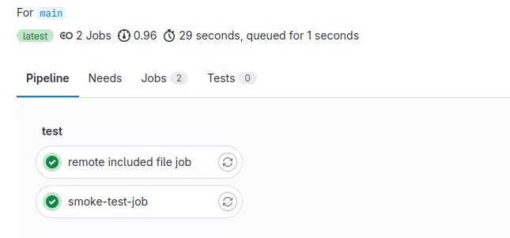

Создан  `local-smoke-tests.gitlab-ci.yml`

```yaml
smoke-test-job:
  script: echo "SMOKE"
```

Создан основной файл `.gitlab-ci.yml`

```yaml
include:
  - local: local-smoke-tests.gitlab-ci.yml
  - remote: https://github.com/MaxiRage/JavaHomeWork/blob/ci_cd_4/remote_included-file.yml
```


